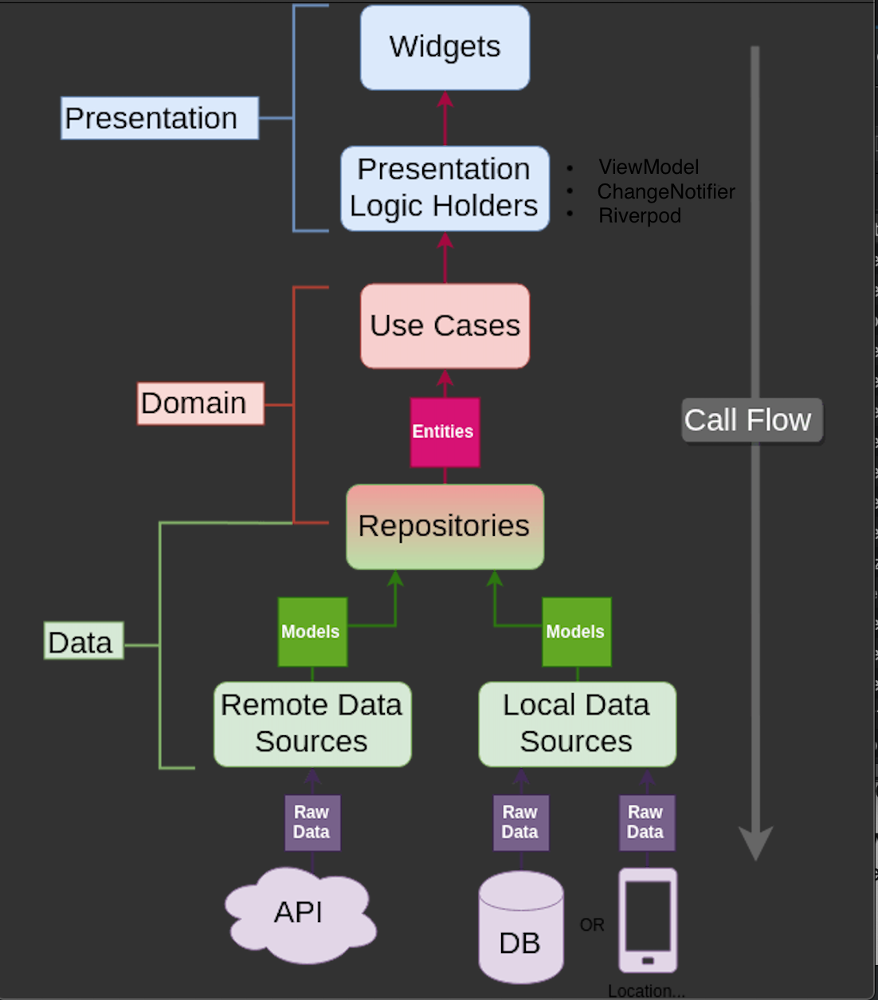

# Android Architecture Blueprints

Android Architecture Blueprint is a project that follows Clean Architecture principles and MVVM pattern to develop Android apps.

## Documentation

- [Install Android](https://developer.android.com/guide/slices/getting-started)
- [Android documentation](https://developer.android.com/docs)
- [The Clean Architecture (Uncle Bob)](https://blog.cleancoder.com/uncle-bob/2012/08/13/the-clean-architecture.html)
- [MVVM pattern](https://en.wikipedia.org/wiki/Model%E2%80%93view%E2%80%93viewmodel)
- [Coroutines] (https://developer.android.com/kotlin/coroutines)
- [RxKotlin] (https://github.com/ReactiveX/RxKotlin)
- [Retrofit](https://square.github.io/retrofit/)
- [Dagger (Dependency Injection)](https://dagger.dev/)
- [Mockito](https://github.com/mockito/mockito)
- [Espresso](https://developer.android.com/training/testing/espresso)


## Environment

**Android**
- Android 5.1+
    - minSdkVersion 23
- targetSdkVersion 30

## App architecture

There are 3 main modules to help separate the code. They are Data, Domain, and Presentation.
   
- **Data (Particular project)**: contains Local/Remote Data Source, APIs, Data objects (Request/Response object, DB objects), and the repository implementation.
   
- **Domain (Particular project)**: contains UseCases, Domain Objects/Models, and Repository Interfaces
   
- **Presentation**: contains UI, app style, app configurations, View Model (hold view state and presentation logic), etc. Can be split into separate modules itself if needed. For example, we could have a module called Device which handles platform things such as camera, location, etc.

# Entities
 - Enterprise-wide business rules
 - Made up of classes that can contain methods
 - Business objects of the application
 - Used application-wide
 - Least likely to change when something in the application changes
# Repository
 - Bridge between Data layer and Domain layer
 - Connects to data sources and returns mapped data
 - Data sources include DB, Api etc...
# UseCase
 - Responsible for connecting to repository to retrieve necessary data. 
 - This is where the business logic takes place.
 - Returns data downstream.
 - Single responsibility.
# ViewModel
 - Organizes data and holds View state.
 - Communicate with use cases.
# View
 - Observes changes from ViewModel.
 - Updates UI.
# Data Sources
 - Fetch data from json files.
```
    assets/data/cards.json
    assets/data/components.json
```

<h3 align="center">Architecture</h3>



### Test

- [Mockito](https://github.com/mockito/mockito)
- [Espresso](https://developer.android.com/training/testing/espresso)
- [Junit] (https://developer.android.com/training/testing/unit-testing)
- Write unit test for ViewModel (**CardsViewModel** & **ComponentsViewModel**).
- Able to write particular unit test for **data** module and **domain** module.

